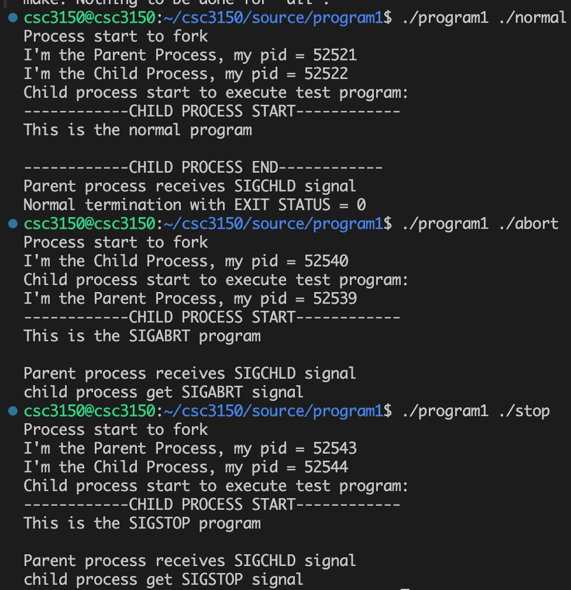
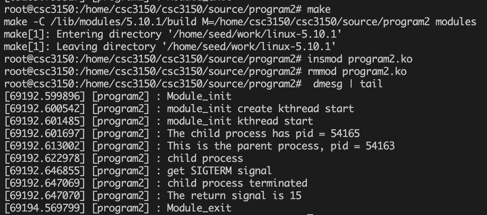
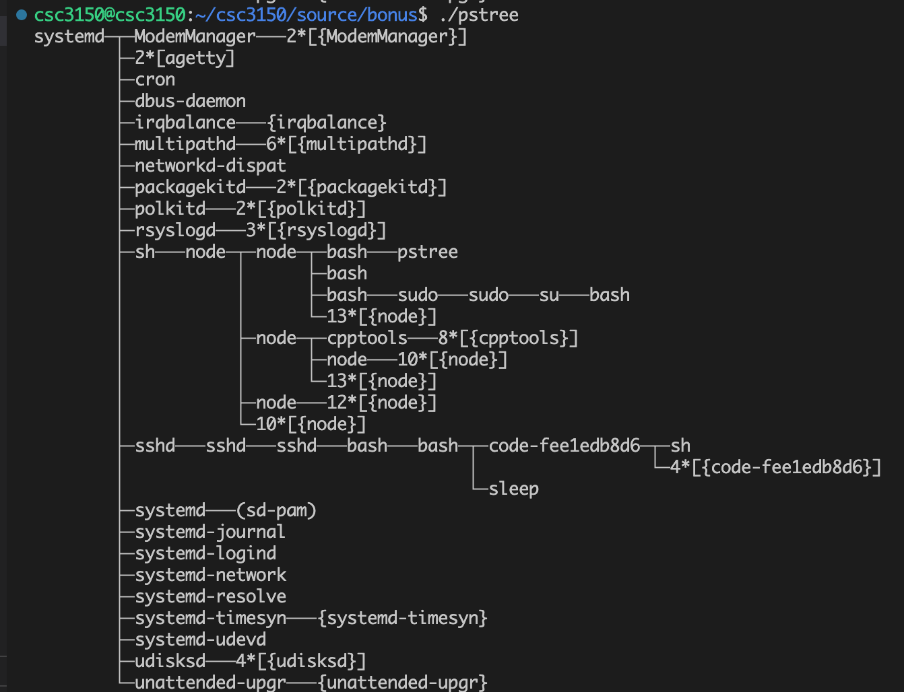
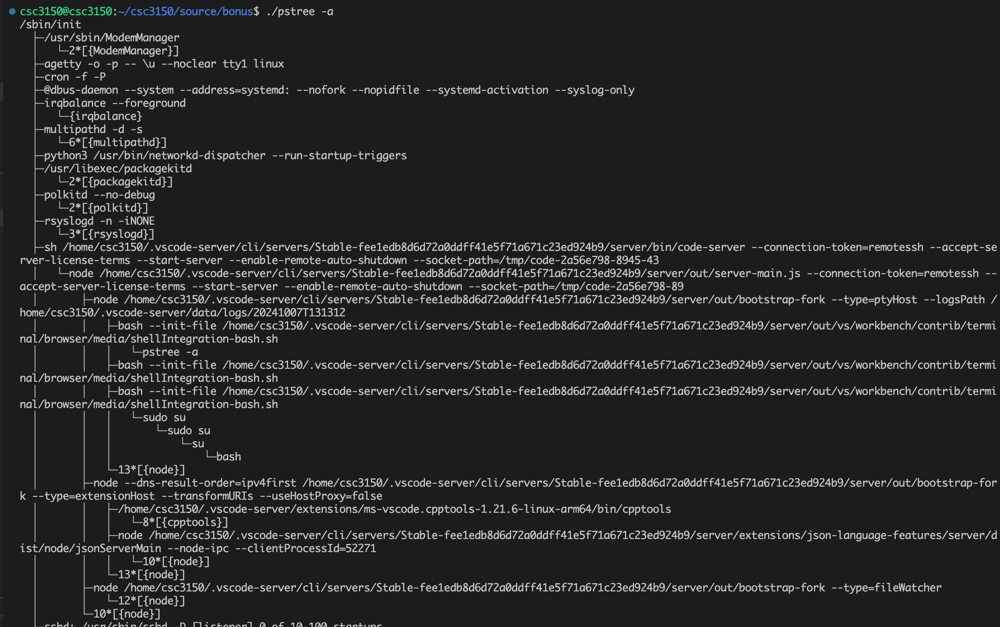
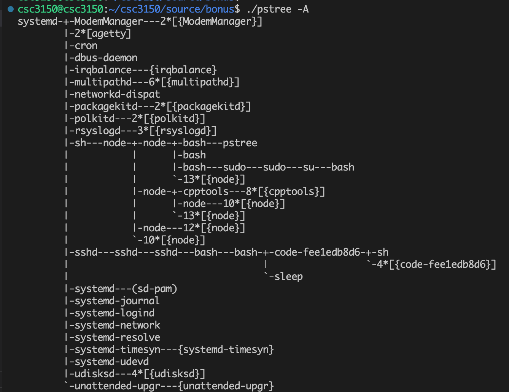
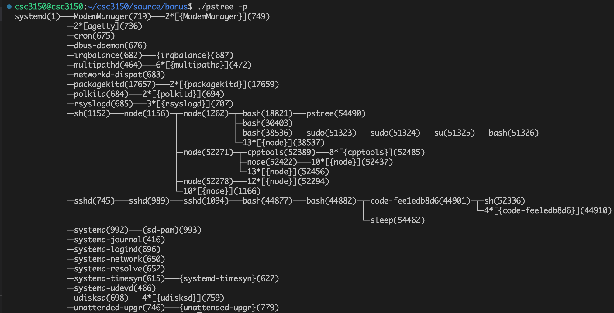
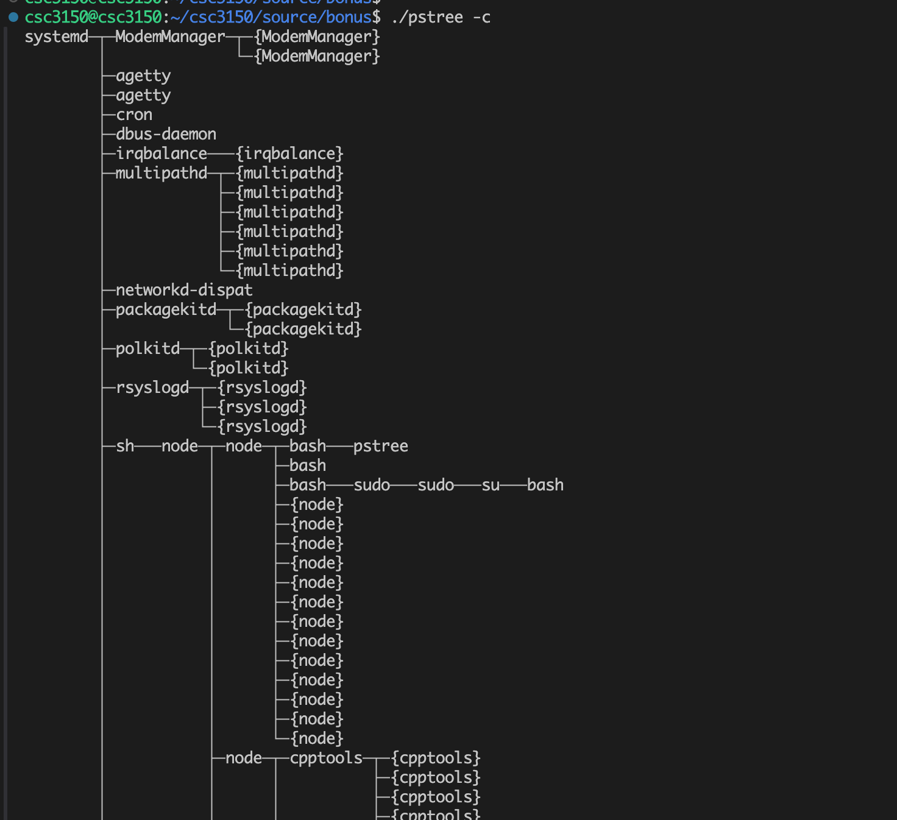
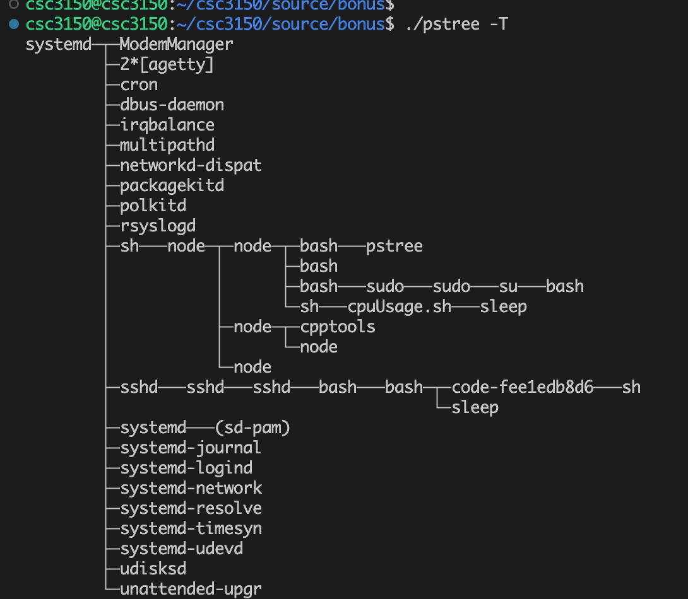
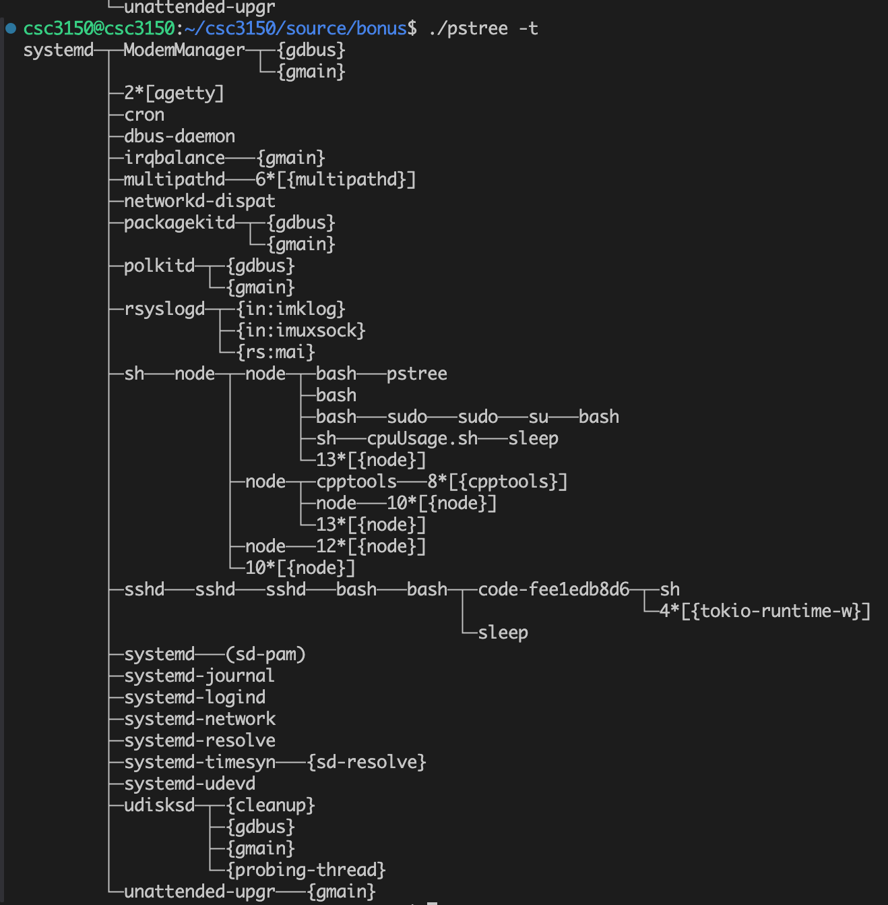

# Report for CSC3150 - Assignment 1

## Name: Wang Chaoren
## Student ID: 122090513

## How did you design your program? (4 points)

### For Task 1: 

I designed this program to create a child process using `fork()` and handle `SIGCHLD` signals to notify the parent when the child’s state changes. The child runs an external program with `execl()`, while the parent monitors it using `waitpid()` to check if the child exited normally, was terminated, or stopped by a signal.

To make the output easier to understand, a `map_status()` function that converts signal numbers into readable names. 

### For Task 2:

I created a kernel thread that forks a child process using `kernel_clone()`. When the module is loaded, the `program2_init()` function starts a thread to run `my_fork()`, which sets up default signal handling (with in code template), creates the child process, and waits for it to finish using `kernel_wait()`.

The child process runs `my_exec()`, where it attempts to execute a test program located at `/tmp/test` using `kernel_execve()`. Print statements were added to display both the parent and child process IDs, helping track their relationship and execution in the kernel logs.

To record different termination scenarios, a `map_status()` function was used like Task 1.

### Bonus Task:

I wrote this C program to visualize the process tree in a Linux system by reading from the `/proc` filesystem. I define a structure, `process_node_t`, to store information like the process ID (`pid`), parent process ID (`ppid`), name, and command line. It gathers these details for each process/threads.

After collecting, a tree structure was built in `build_process_tree()` by linking child processes to their respective parents. Depending on the flags, like `sort_by_pid`, the program can sort child processes by name or ID to make the output more organized.

The `print_process_tree()` function then displays the process hierarchy, with options to include PIDs, command line arguments, or use ASCII for a simpler view. 


## How to set up your development environment, including how to compile kernel? (2 points)

I follow the guide provided by the Tutorial 1 to set up the development environment.

1. Download && Install UTM && Load Image
2. Install the necessary packages
3. `scp` the template code to the VM
4. Downloading kernel source code 5.15.10 && Compile the 5.15.10 kernel according to the tutorial.
5. Failed to build due to disk space issue, then increate the disk space, follow [this](https://linux.afnom.net/install_apple/apple_silicon.html#expanding-your-utm-vms-storage-a-nameutm-storage-expanda).
6. Failed to build, certs error, follow [this](https://stackoverflow.com/questions/67670169/compiling-kernel-gives-error-no-rule-to-make-target-debian-certs-debian-uefi-ce) to fix it.
7. Failed to build, due to `pahole` wrong version, follow [this](https://blog.csdn.net/woay2008/article/details/132748659) to fix it.
8. Successfully build the kernel.
9. Load the kernel into VM, and boot it.
10. Failed to start the system, unknown reason.
11. Try again to build 5.10.1 kernel.
12. Cannot build, due to `pahole` issue, previous fix does not work. Follow [this](https://www.reddit.com/r/wsl2/comments/179kdh7/failed_load_btf_from_vmlinux/?tl=es-es) to disable `BTF`.
13. Successfully build the kernel.
14. Load the kernel into VM, and boot it.
15. For better development experience, using `vscode` to connect the SSH.
16. Possible network issue, failed to start vscode, manually downloaded the vscode server and `scp` to the VM.


## Screenshot of your program output. (2 points)

### Task 1:


### Task 2:

Remember to copy the executable file to `/tmp/test` before running the module.
```
cp executable_file /tmp/test
```


### Bonus Task:

Supported 7 arguments:

```
OPTIONS
       -a     Show command line arguments.  If the command line of a process is swapped out, that process is shown in parentheses.  -a implicitly  disables
              compaction for processes but not threads.

       -A     Use ASCII characters to draw the tree.

       -c     Disable compaction of identical subtrees.  By default, subtrees are compacted whenever possible.

       -n     Sort processes with the same parent by PID instead of by name.  (Numeric sort.)

       -p     Show PIDs.  PIDs are shown as decimal numbers in parentheses after each process name.  -p implicitly disables compaction.

       -t     Show full names for threads when available.

       -T     Hide threads and only show processes.
```









## What did you learn from the tasks? (2 points)

Task 1: I learn how the parent manage the child’s lifecycle and the signal handling in Unix-like systems.

Task 2: I learn how to export kernel symbols and use them in a kernel module. I also learned how to create kernel threads and manage them by inserting and removing modules.

Bonus Task: I learn the structure of the `/proc` filesystem and how to read process information from it. Also explore how to build a process tree and display it in a structured way.

